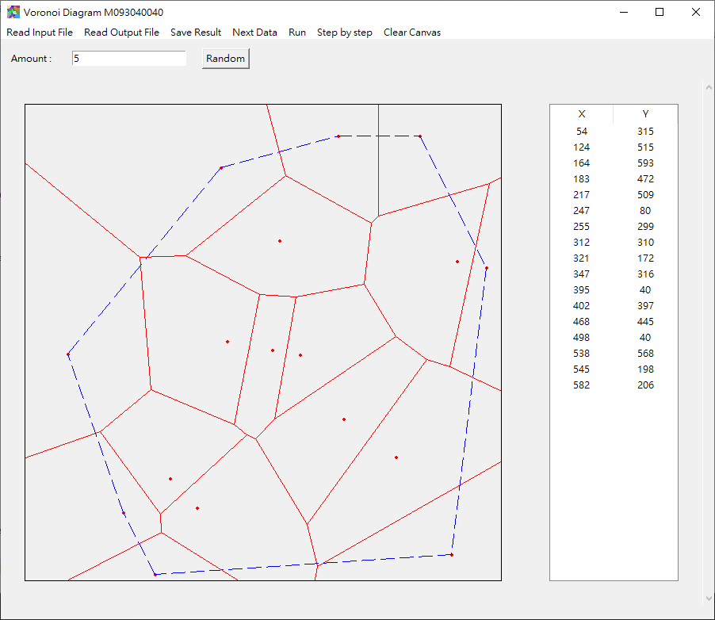

# Voronoi_Diagram
 Voronoi Diagram using Divide-and-Conquer. 

## Description
This project is the final assignment for my master's degree in the course "Design and Analysis of Algorithms." The project utilizes the 'tkinter' package for GUI.

The key features of this project include:   
* Implementation of the **divide-and-conquer** algorithm for solving the Voronoi diagram.
* You can use the "Step by Step" mode to observe how the algorithm works.
* Ability to read input and output data. (.txt)
* Can save the resulting diagram as a 'txt' file.

## Usage
If you want to use the program directly on Windows, you can utilize 'Voronoi_diagram.exe'.

There are some testing data files available for you to try in the 'Test_Input' folder.  
`Please note that the data inside the 'fail' folder does not generate the correct Voronoi diagram.`

## Demo

## Note
Voronoi Diagram 是由鄰近點的中垂線形成。  
詳細說明可以看**index.html**

Diveid-and-conquer 三個部分
* Divide: spilt the origin problem into 2 sub-problems with equal sizes.
* Conquer (Recursive): Recursively solve these 2 sub-problems by applying this algoritm.
* Combine (Merge): Merge the solutions of the 2 sub-problems into a solution of the origin problem.

Input: A set S of n planar points.
Output: The voronoi diagram of S.
1. If S contains only one point, return.
2. Find a median line L perpendicular to the X-axis which divides S into S_l and S_r, with equal sizes.